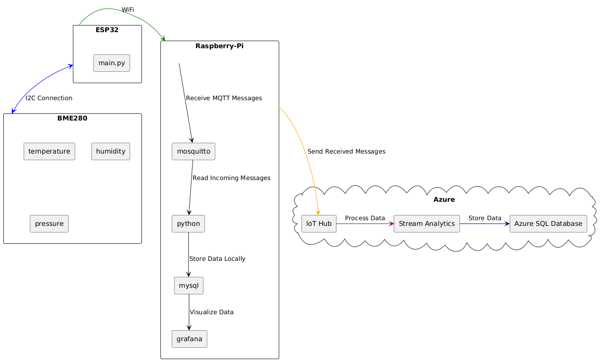

# 1. Architecture

### 1.1 ESP32
* Read values from BME280 sensor.
* Send data to Raspberry Pi via MQTT protocol.
### 1.2 Raspberry Pi
* Receives MQTT messages.
* Parses MQTT messages into JSON.
* Attempts to send data to Azure.
* Uploads the data into the local database. (And appends a True or False value depending on response from Azure)
* Displays data from the local database in grafana.
### 1.3 Azure
* Receives messages from Raspberry Pi in the IoT Hub.
* Stream analytics converts JSON to SQL query.
* Stores data in cloud database.